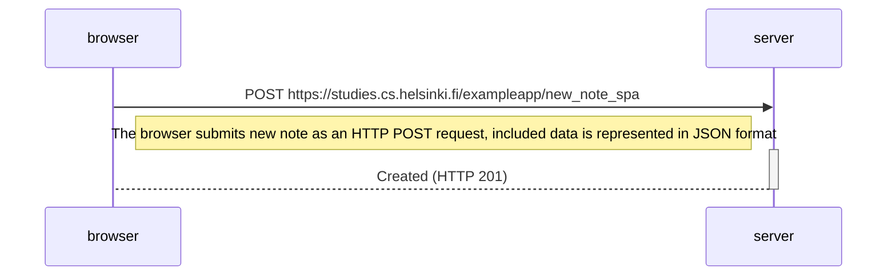

```mermaid
sequenceDiagram
    participant browser
    participant server

    browser->>server: POST https://studies.cs.helsinki.fi/exampleapp/new_note_spa

    Note right of browser: The browser submits new note as an HTTP POST request, included data is represented in JSON format

    activate server
    server-->browser: Created (HTTP 201)
    deactivate server
```